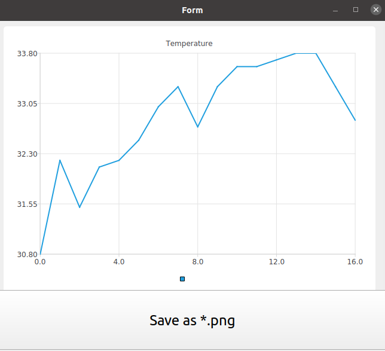

# Qt5 temperature controller.

The application communicates with the Arduino board through the serial port to read the temperature and write the state of the executable objects.

## Features
### The read data can be visualized in the form of:

* color chart,

* table
  
### The read data can be saved as:
* .png 
* .csv
  
### The read data can be accessed from the standard fortune server client.
 

## Project goal

Designing an application template for smart home or factory automation

## Requirements 
* CMake
* Qt5 with: Charts, Sql, SerialPort, Concurrent, Network
* Arduino IDE 

## Setup
The PC running the application connects via USB cable to an already programmed Arduino board with a temperature sensor (BMP180) to start working.

## Useful Resources
* [Fortune client](https://doc.qt.io/qt-6/qtnetwork-fortuneclient-example.html)
* [BMP180 Datasheet](https://cdn-shop.adafruit.com/datasheets/BST-BMP180-DS000-09.pdf)

## Docs
[By doxygen](Docs/)
